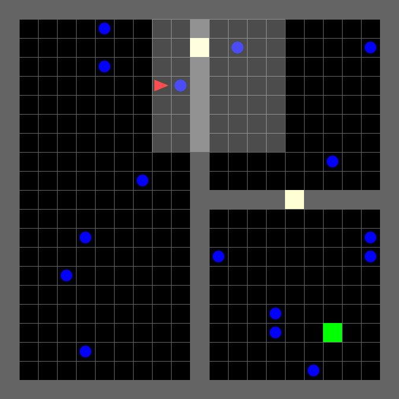
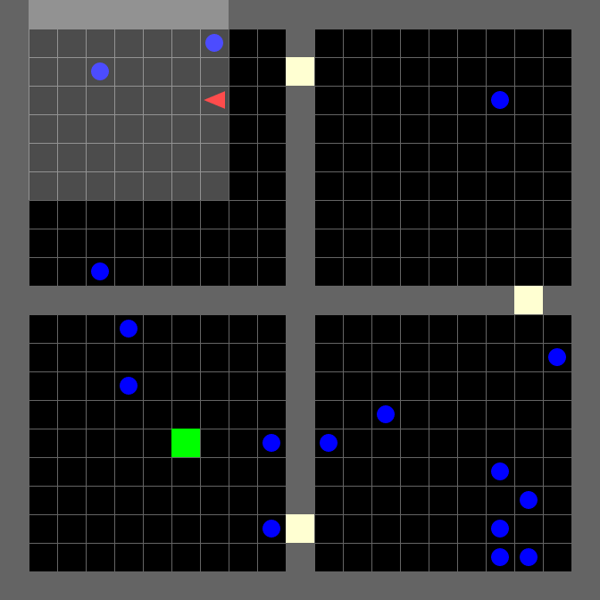

# ME5406_Project2_Dynamic_Obstacle_Grid_FHL 
This repository contains the implementation of reinforcement learning algorithms like PPO and A2C, to solve the problem: Dynamic Obstacle Avoidance in Generalized Environment. And test the **generalization and migration** of the trained model using these algorithms.

## Project Description
> The objective of this project is to Deep Reinforcement Learning techniques to implement the **Dynamic Obstacle Avoidance in Generalized Environment**. 
> The problem is essentially a grid-world scenario in which the agent’s target is to go from the start point, go through the room by exit which was randomly setalong the wall, and reach the goal which set in another room, while avoiding crashing into dynamic obstacles in the environment. Meanwhile, the adding of the field of views enables the agent to have the ability of partial or fully observation. It has to be mentioned that the generalization ability oftrained model is tested during the process.

The available environments are: `ThreeRooms-Dynamic-Obstacles-21x21-v0` and `FourRooms-Dynamic-Obstacles-21x21-v0`:
* 📈 Tensorboard Logging
* 📜 Local Reproducibility via Seeding
* 🎮 Videos of Gameplay Capturing
* 🧫 Experiment Management with [Weights and Biases](https://wandb.ai/fhl1998/me5406?workspace=user-fhl1998)

## Project Preparation 
 ### Virtual Environment Creation
 First, create the virtual environment using Anoconda and activate the created environment in **Ubuntu 18.04**.
 
```python
$ conda create -n obstacle_grid python=3.6
$ source activate obstacle_grid
```

 ### Requirements Install  
The project is based on the python version `Python 3.6.8`. For the requirements, a new virtual environmrnt is recommended. You should install the required packages in `requirements.txt` using:
```python
pip install -r requirements.txt
```

In order to use GPU acceleration, be sure to install suitable CUDA version as well, for the project the installation command is:
```python
conda install pytorch==1.7.1 torchvision==0.8.2 torchaudio==0.7.2 cudatoolkit=11.0 -c pytorch
```


## Project Execution 
The main scripts of the project are: `train.py`, `evaluate.py`, and `visualize.py`. For the detailed usage please refer to the parser in the corresponding files. The example of training, evaluation and visualization can be illustrated as:
### Trian
- A2C Agent
```python
python train.py --env 'ThreeRoom' --algo a2c --frames-per-proc 8
python train.py --env 'ThreeRoom' --algo a2c --frames-per-proc 8 --memory --recurrence 2
```
- PPO Agent
```python
python train.py --env 'ThreeRoom' --algo ppo --frames-per-proc 128
python train.py --env 'ThreeRoom' --algo ppo --frames-per-proc 128 --memory --recurrence 2
```

### Evaluate
- Evaluate in 3-room Environment
```python
python evaluate.py --eval_env 'ThreeRoom' --algo ppo --recurrence 1
python evaluate.py --eval_env 'ThreeRoom' --algo ppo --memory --recurrence 2
```
- Evaluate in 4-room Environment
```python
python evaluate.py --eval_env 'FourRoom' --algo ppo --recurrence 1
python evaluate.py --eval_env 'FourRoom' --algo ppo --memory --recurrence 2
```

### Visualize
- Visualize in 3-room environment
```python
python visualize.py --env 'ThreeRoom' --algo ppo --recurrence 1
python visualize.py --env 'ThreeRoom' --algo ppo --memory --recurrence 2
```
- Visualize in 4-room environment
```python
python visualize.py --env 'FourRoom' --algo ppo --recurrence 1
python visualize.py --env 'FourRoom' --algo ppo --memory --recurrence 2
```

### Tensorboard & WanDB
During training, logs are recorder in Tensorboard and Weights & Biases, and an example of using tensorboard:
```python
cd storage/ppo_4
tensorboard --logdir=./ --host=127.0.0.1
```

## Result Display 
### 3-room Environment

<table>
    <tr>
            <th>A2C Agent</th>
            <th>PPO Agent</th>
    </tr>
    <tr>
        <td></td>
        <td></td>
    </tr>
</table>

### 4-room Environment
<table>
    <tr>
            <th>PPO Agent</th>
            <th>PPO+LSTM2 Agent</th>
            <th>PPO+LSTM4 Agent</th>
    </tr>
    <tr>
        <td></td>
        <td></td>
        <td></td>
    </tr>
</table>

